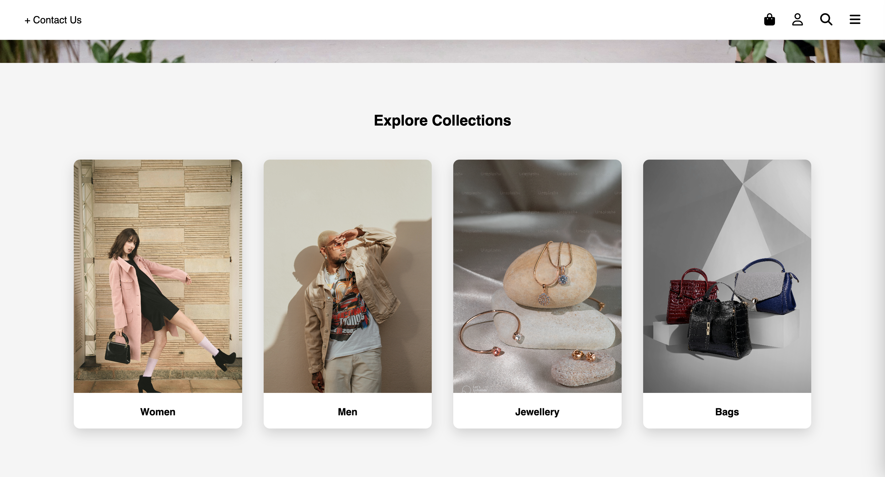
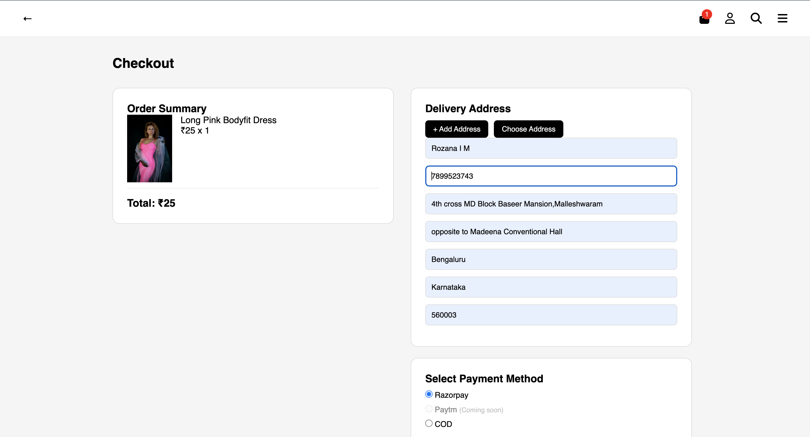
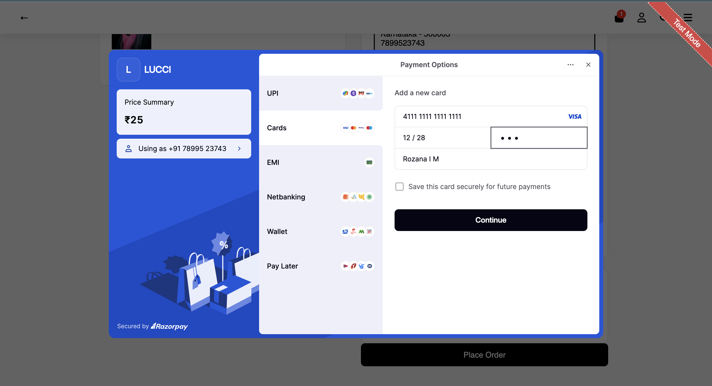
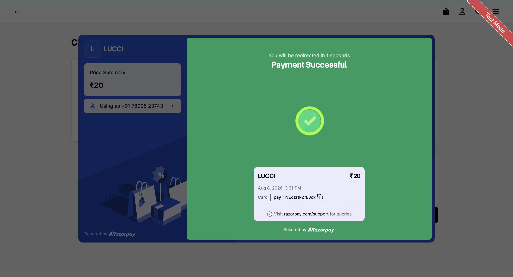

<div align="center">

# 🛍️ LUCCI Frontend

----
### Frontend Application for the LUCCI Cloud Native E-Commerce Platform
<br/>

<div align="center">

[](https://developer.mozilla.org/en-US/docs/Web/HTML)
[](https://developer.mozilla.org/en-US/docs/Web/CSS)
[](https://developer.mozilla.org/en-US/docs/Web/JavaScript)
[](https://aws.amazon.com/s3/)
[](https://aws.amazon.com/cloudfront/)
[](https://aws.amazon.com/route53/)
[](https://www.jenkins.io/)


</div>

<br/>

> Built using **HTML5 + CSS3 + JavaScript**
>
> Automated frontend deployment using **Jenkins + Amazon S3 + CloudFront**
>
> Hosted on **Amazon S3** and delivered globally through **Amazon CloudFront**
>
> Communicates securely with backend microservices through REST APIs.
</div>

----
# 📑 Table of Contents

- [Overview](#overview)
- [Frontend Responsibilities](#frontend-responsibilities)
- [Project Repositories](#project-repositories)
- [Architecture](#architecture)
- [Features](#features)
- [Tech Stack](#tech-stack)
- [AWS Infrastructure](#aws-infrastructure)
- [CI/CD Pipeline](#cicd-pipeline)
- [Frontend Repository Structure](#frontend-repository-structure)
- [Frontend Deployment Flow](#frontend-deployment-flow)
- [Application Screenshots](#application-screenshots)
- [Future Improvements](#future-improvements)
- [Getting Started](#getting-started)
- [Author](#author)

----
<a id="overview"></a>
# 🔍 Overview

This repository contains the customer-facing frontend application for the LUCCI Cloud Native E-Commerce Platform.

The frontend is developed using HTML5, CSS3, and JavaScript and is deployed as a static website on Amazon S3. Amazon CloudFront provides low-latency content delivery, while Route 53 manages DNS routing.

The frontend communicates with backend microservices through REST APIs exposed via an Application Load Balancer.

The complete LUCCI platform consists of:

- Frontend
- User Service
- Product Service
- Order Service
- Payment Service
----

<a id="frontend-responsibilities"></a>
# 🌐 Frontend Responsibilities

The frontend application is responsible for:

- Displaying products and collections
- Managing the shopping cart
- Handling the checkout experience
- Managing user sessions
- Displaying order history
- Integrating with backend REST APIs
- Providing a responsive shopping experience across devices

----

<a id="project-repositories"></a>
# 📦 Project Repositories

| Repository | Description |
|------------|-------------|
| **[Frontend](https://github.com/rozanaim2026/frontend-aws-devops)** *(Current Repository)* | Customer-facing web application |
| **[User Service](https://github.com/rozanaim2026/user-service)** | Authentication & User Management |
| **[Product Service](https://github.com/rozanaim2026/product-service)** | Product Catalog |
| **[Order Service](https://github.com/rozanaim2026/order-service)** | Order Processing |
| **[Payment Service](https://github.com/rozanaim2026/payment-service)** | Razorpay Integration |

----

<a id="architecture"></a>
# 🏗️ Architecture

<p align="center">
  
</p>

----

### Architecture Flow

```
Users
   │
Route53
   │
CloudFront
   │
Amazon S3
   │
Frontend
   │
REST API Requests
   ▼
Application Load Balancer
   │
Backend Microservices
```

---

### Request Flow

1. Users access the application using the custom domain managed by **Amazon Route 53**.

2. Static frontend assets are served from **Amazon S3** through **Amazon CloudFront**.

3. The frontend sends REST API requests to the backend through the **Application Load Balancer**.

4. Backend microservices process the requests and return responses to the frontend.
---


<a id="features"></a>
## ✨ Features


- Responsive HTML5, CSS3 & JavaScript Frontend
- Responsive Design
- Product Browsing
- Product Categories
- Product Details
- Shopping Cart
- Checkout Workflow
- Wishlist Management
- Order Tracking
- User Profile
- REST API Integration
- Cloud-Native Deployment

----
<a id="tech-stack"></a>
# 🛠️ Tech Stack

| Category | Technology | Purpose |
|-----------|------------|---------|
| Frontend | HTML5 | Structure |
| Styling | CSS3 | User Interface |
| Scripting | JavaScript (ES6) | Client-side Functionality |
| CI/CD | Jenkins | Automated Deployment |
| Hosting | Amazon S3 | Static Website Hosting |
| CDN | Amazon CloudFront | Global Content Delivery |
| DNS | Amazon Route 53 | Domain Management |
| SSL | AWS Certificate Manager | HTTPS |
| Version Control | Git & GitHub | Source Code Management |
---

<a id="aws-infrastructure"></a>
# ☁️ AWS Infrastructure

The application is deployed using a secure AWS architecture that separates public-facing resources from backend services running inside a private network.


| AWS Service | Purpose |
|--------------|---------|
| Amazon S3 | Static Website Hosting |
| Amazon CloudFront | Global Content Delivery Network (CDN) |
| Amazon Route 53 | DNS Management |
| AWS Certificate Manager | SSL/TLS Certificates |
| Jenkins | Automated CI/CD Pipeline |

---


<a id="cicd-pipeline"></a>
# 🚀 CI/CD Pipeline

The frontend deployment is fully automated using **Jenkins**, **Amazon S3**, and **Amazon CloudFront**.

```
Developer
     │
Git Push
     ▼
GitHub Repository
     │
Webhook
     ▼
Jenkins Pipeline
     │
Run build.sh
     ▼
Deploy Build to Amazon S3
     │
Invalidate Frontend CloudFront
     │
Invalidate Images CloudFront
     ▼
Updated Website Available
```

---

## ⚙️ Jenkins Pipeline Stages

| Stage | Purpose |
|--------|---------|
| Checkout Source | Retrieve the latest frontend source code |
| Build Frontend | Execute `build.sh` to generate production-ready frontend assets |
| Deploy to Amazon S3 | Upload the generated build files to the S3 bucket |
| Invalidate Frontend CloudFront | Clear cached frontend content |
| Invalidate Images CDN | Refresh cached image assets |
---


<a id="frontend-repository-structure"></a>
# 📁 Frontend Repository Structure

| Folder / File | Description |
|---------------|-------------|
| `assets/` | Architecture diagram and application screenshots used in the documentation |
| `components/` | Reusable HTML components (Navbar, etc.) |
| `public/` | Static frontend assets |
| `src/` | JavaScript logic for frontend features |
| `index.html` | Landing page |
| `products.html` | Product listing page |
| `product-details.html` | Product details page |
| `collections.html` | Product collections |
| `cart.html` | Shopping cart |
| `checkout.html` | Checkout workflow |
| `orders.html` | User order history |
| `order-details.html` | Individual order details |
| `order-success.html` | Successful order confirmation |
| `wishlist.html` | Wishlist management |
| `profile.html` | User profile |
| `admin.html` | Admin dashboard |
| `style.css` | Global styling |
| `build.sh` | Frontend build script |
| `Jenkinsfile` | CI/CD pipeline |
| `package.json` | Project dependencies |

---
<a id="frontend-deployment-flow"></a>
# 🚀 Frontend Deployment Flow

```
Developer
      │
Git Push
      ▼
GitHub Repository
      │
Webhook
      ▼
Jenkins
      │
Run build.sh
      ▼
Production Build
      │
Sync to Amazon S3
      ▼
CloudFront Cache Invalidation
      ▼
CloudFront CDN
      ▼
Route53
      ▼
Users
```
----
<a id="application-screenshots"></a>
# 📸 Application Screenshots


<p align="center">
  
  
</p>

<p align="center">
  
  
</p>

<p align="center">
  
  
</p>

<p align="center">
  
</p>

---

<a id="future-improvements"></a>
# 📈 Future Improvements

- Progressive Web App (PWA)
- Responsive Design Enhancements
- Dark Mode
- Accessibility Improvements (WCAG)
- Image Optimization
- Lazy Loading
- Frontend Unit Testing
- Performance Optimization


---
<a id="getting-started"></a>
# 🚀 Getting Started

## Clone the Repository

```bash
git clone https://github.com/rozanaim2026/frontend-aws-devops.git

cd frontend-aws-devops
```

---

## Install Dependencies

```bash
npm install
```

---

## Start the Development Server

```bash
npm start
```

The application will be available at:

```text
http://localhost:3000
```

---

<a id="author"></a>
# 👩‍💻 Author

<p align="center">

## Rozana IM

Cloud Engineer • DevOps Engineer • AWS Enthusiast

GitHub: https://github.com/rozanaim2026

LinkedIn: https://www.linkedin.com/in/rozana-im-a63541302/

</p>

---

# ⭐ Support

If you found this project helpful,

please consider giving it a ⭐ on GitHub.

It really helps and motivates me to build more cloud-native projects.

---

<div align="center">

## ☁️ Built with HTML5 • CSS3 • JavaScript • Amazon S3 • CloudFront • Jenkins

### ❤️ Part of the LUCCI Cloud Native E-Commerce Platform
</div>
