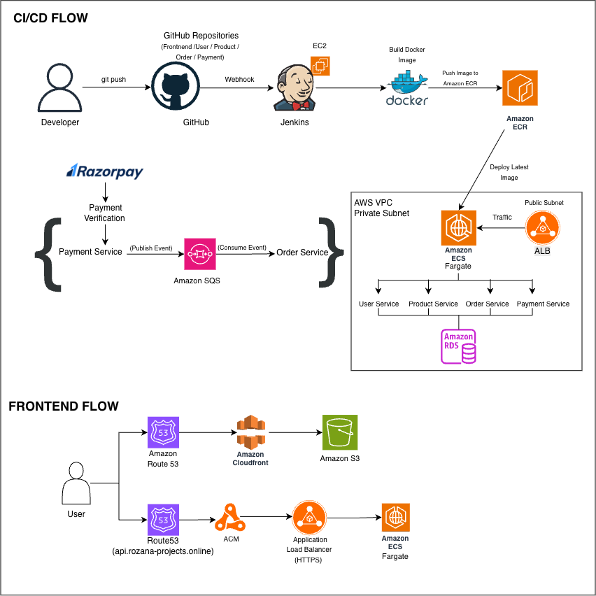

<div align="center">

# 🛍️ LUCCI — Cloud Native E-Commerce Platform

### **A production-grade microservices-based e-commerce platform deployed on AWS using modern DevOps practices**

<br/>

[](https://aws.amazon.com/)
[](https://www.docker.com/)
[](https://www.jenkins.io/)
[](https://aws.amazon.com/ecs/)
[](https://aws.amazon.com/ecr/)
[](https://aws.amazon.com/rds/)
[](https://aws.amazon.com/s3/)
[](https://aws.amazon.com/cloudfront/)
[](https://aws.amazon.com/route53/)
[](https://www.mysql.com/)

<br/>

> Built using **React + Node.js + Express + Docker + Amazon ECS Fargate**  
> Automated deployment with **Jenkins + Amazon ECR**  
> Frontend delivered through **Amazon S3 + CloudFront + Route 53**  
> Event-driven communication using **Amazon SQS**

# 🏗️ Architecture

<p align="center">
  
</p>

</div>

### Architecture Flow

```
Developer
    │
Git Push
    ▼
GitHub
    │
Webhook
    ▼
Jenkins (EC2)
    │
Build Docker Image
    ▼
Amazon ECR
    │
Deploy Latest Image
    ▼
Amazon ECS Fargate
    │
Application Load Balancer
    │
────────────────────────────────────────
User Service
Product Service
Order Service
Payment Service
    │
Amazon RDS MySQL

Payment Service
      │
Amazon SQS
      │
Order Service

────────────────────────────────────────

User
 │
Route53
 │
CloudFront
 │
Amazon S3
 │
React Frontend
 │
API Calls
 │
Application Load Balancer
```

---

### Request Flow

1. The user accesses the application through **Route 53**.

2. Static React assets are served from **Amazon S3** via **CloudFront**.

3. API requests are routed through the **Application Load Balancer**.

4. The ALB forwards requests to the appropriate **ECS Fargate microservice**.

5. Services communicate with **Amazon RDS MySQL** for persistent storage.

6. Payment events are published to **Amazon SQS**, allowing the Order Service to process them asynchronously.

7. Docker images are automatically built by Jenkins and deployed to ECS through Amazon ECR.

---

---
# 🔍 Overview

LUCCI is a **production-style cloud-native e-commerce platform** designed using a **microservices architecture** and deployed entirely on **Amazon Web Services (AWS)**.

Instead of deploying a single monolithic application, LUCCI separates business functionality into multiple independent services that communicate securely while running inside **Amazon ECS Fargate**.

The project demonstrates real-world cloud engineering concepts including:

- Containerized microservices using Docker
- Automated CI/CD with Jenkins
- Image management using Amazon ECR
- Secure networking with Amazon VPC
- Public & Private Subnets
- Application Load Balancer
- Amazon RDS MySQL
- Amazon SQS asynchronous messaging
- HTTPS using AWS Certificate Manager
- Frontend hosting using Amazon S3
- Global content delivery using CloudFront
- DNS management using Route 53

----

# 📦 Project Repositories

| Repository | Description |
|------------|-------------|
| **https://github.com/rozanaim2026/frontend-aws-devops.git** | React Application |
| **https://github.com/rozanaim2026/user-service.git** | User Authentication & Profile |
| **https://github.com/rozanaim2026/product-service.git** | Product Catalog |
| **https://github.com/rozanaim2026/order-service.git** | Order Management |
| **https://github.com/rozanaim2026/payment-service.git** | Razorpay Integration |


